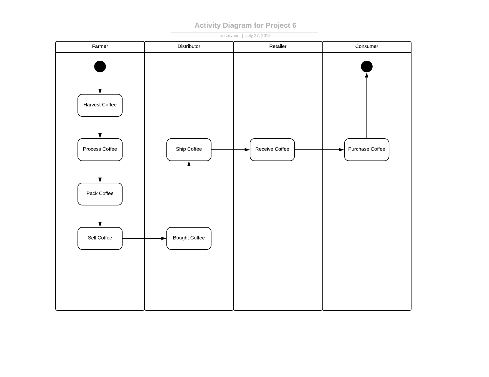
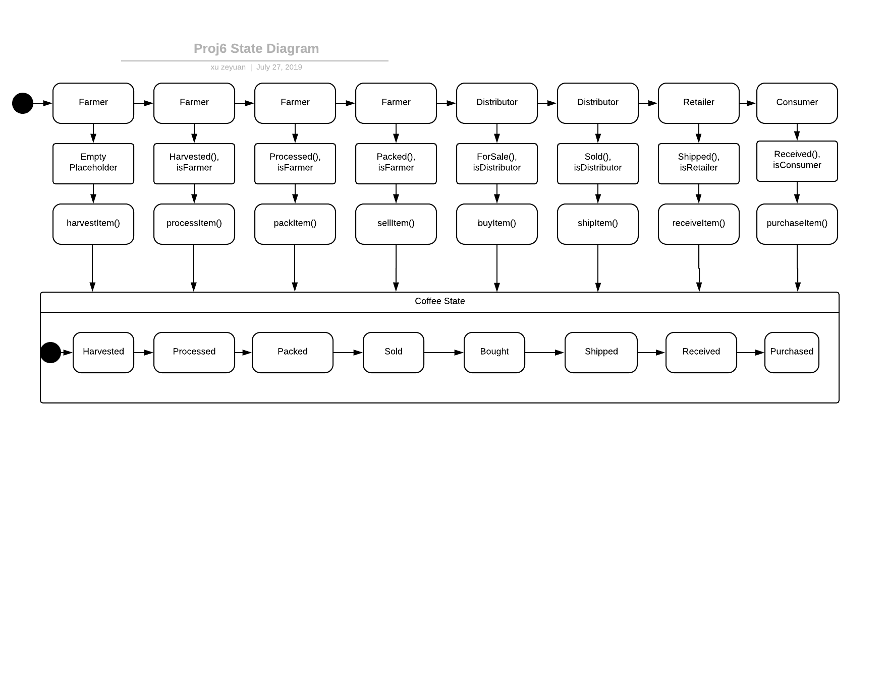
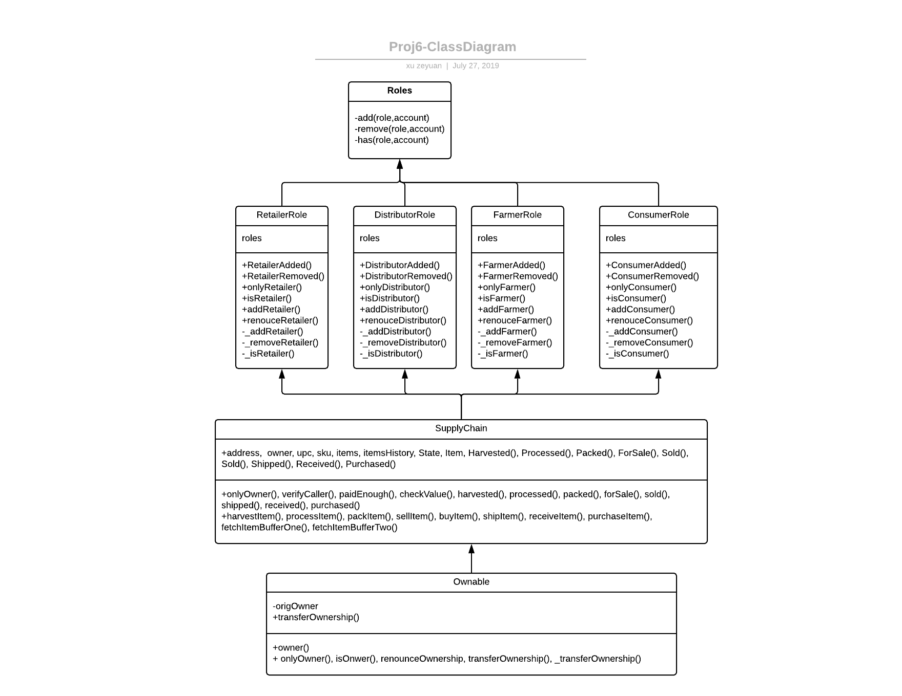

### General Information

#### Run the App:

run unit tests

```
cd project-6 
npm install 
truffle develop 
compile 
migrate --reset 
test 
```

run the frontend:
```
cd project-6 
npm run dev
```

* __Contract Addresses__: 
  * FarmerRole: `0x6FA03e9436112440B38966f8a6d259eD59d77A43`
  * DistributorRole: `0x49A08a85fA223c5DAf55e34946aC3ee77DE9a1e0`
  * RetailerRole: `0xe871fefa7c22750Ae89C987A0127E481b322adFf`
  * ConsumerRole: `0x47439e4673b90FB0dE730FC21aA9CD3c00e8f27E`
  * SupplyChain: `0xa58013a1187bA02c33fB0c3eA712AEad2f931956`

* __Libraries Used__: Besides the libraries used in the starter code, library `truffle-assertions` is used in the test code: this is because the `event.watch` syntax no longer works for web3js version 1.0.0, and `truffle-assertions` is the library used to observe whether an event has been emitteed.
* __IPFS__: IPFS is not used here.
* Version Number: 1.0.0
* Node version: v8.9.4
* Truffle Version: v5.0.28
* Web3 version: v1.0.0-beta.37


### Diagrams

#### Activity Diagram

#### Sequence Diagram

#### State Diagram

#### Class Diagram
